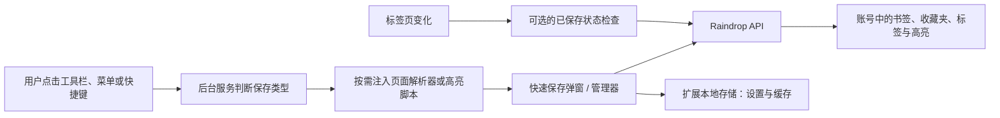

# Raindrop.io CRX 分析

**分析对象：** `LDGFBFFKINOOELOADEKPMFOKLNOBPIEN_6_7_8_0.crx`  
**分析日期：** 2026-07-21  
**用途：** OpenBookmark 的净室视觉与行为参考  
**结论状态：** 静态分析完成；登录态动态验证待补充

## 1. 样本与完整性

- 文件格式：Google Chrome Extension，CRX3
- 文件大小：1,011,973 bytes
- SHA-256：`71ac1b62cefc6f93c7b0cc548f406e540348963e200cac0a27752ad4a6cdfdf5`
- Manifest 版本：3
- 扩展版本：`6.7.8`
- `version_name`：`5.7.8`，与扩展版本不一致，应视为上游包内的元数据差异
- 扩展 ID：`ldgfbffkinooeloadekpmfoklnobpien`
- 解包文件：59 个，约 2.63MB
- 内置语言：16 种，包括简体中文、繁体中文和英文

CRX 原文件未被修改。解包内容只用于观察和记录，不进入 OpenBookmark 源码或发布包。

## 2. 分析边界

本次分析覆盖：

- Manifest、权限、入口和资源结构
- 安装引导页及其内置官方截图
- 可观察的路由、命令、右键菜单和浏览器 API 使用方式
- 页面元数据解析和高亮脚本的行为
- CSS 设计令牌、尺寸和布局规则
- 原插件与 OpenBookmark 已冻结需求的差异

当前运行环境不允许启动未安装扩展的 Chromium 进程，因此没有完成登录态下的弹窗、全页管理器和设置页动态操作。文档只把静态包能够直接证明的内容写成事实；需要运行后才能确认的状态单独列在末尾。

## 3. 扩展结构

| 入口 | 文件或路径 | 可观察用途 |
|---|---|---|
| 工具栏弹窗 | `index.html?action` | 保存当前页面或选中文本 |
| 侧边栏 | `sidepanel.html` | 浏览、搜索和添加书签 |
| 后台服务 | `background.js` | 命令、右键菜单、标签页监听、权限与脚本注入 |
| 安装引导 | `welcome/index.html` | 介绍保存、侧边栏、地址栏搜索、高亮等能力 |
| 页面解析器 | `assets/parse.js` | 按需读取当前页面元数据 |
| 高亮脚本 | `assets/highlight.js` | 按需显示、创建、修改和删除页面高亮 |
| 主应用 | `assets/app.js` | 弹窗、管理器、账号、设置和共享界面 |
| 样式系统 | `assets/app.css` | 主题、尺寸、组件与响应式布局 |

静态路由字符串表明，同一主应用包还包含账号登录、Clipper、高亮、导入、备份和 Pro 设置等页面。包中存在路由不代表每项功能都会在当前登录状态或套餐下显示。

## 4. Manifest 权限

### 4.1 默认权限

| 权限 | 用途 |
|---|---|
| `contextMenus` | 创建页面、链接、图片、视频、选中文本和扩展图标菜单 |
| `activeTab` | 用户触发时访问当前标签页 |
| `scripting` | 按需注入页面解析器和高亮脚本 |
| `storage` | 保存插件设置、缓存和本地状态 |
| `sidePanel` | 打开浏览器侧边栏 |

### 4.2 可选权限

| 权限 | 用途 |
|---|---|
| `tabs` | 已保存页面指示器和标签页状态监听 |
| `*://*/*` | 在用户授权的网站上显示、编辑高亮等页面内能力 |

原插件没有默认 `host_permissions`，也没有静态 `content_scripts`。它通过用户操作和可选授权按需注入脚本，这比 OpenBookmark 当前确认的“默认申请全站读取权限”更保守。此差异不自动修改既有 ADR，但实现前应再次进行商店审核风险检查。

## 5. 浏览器入口

### 5.1 工具栏与快捷键

- 点击扩展按钮打开快速保存弹窗。
- `Ctrl+Shift+S` 触发保存页面或保存当前选中文本。
- `Ctrl+.` 打开侧边栏。
- 另有“打开 Raindrop 网站”命令，但没有固定默认快捷键。

保存快捷键会先检查页面中是否存在非空文本选择：有选区时进入高亮流程，否则进入网页保存流程。

### 5.2 右键菜单

静态代码创建了以下入口：

- 保存当前页面
- 保存链接
- 保存视频
- 保存图片
- 保存选中文本为高亮
- 打开侧边栏
- 打开完整应用
- 保存全部标签页
- 打开设置

打开完整应用时使用约 1280×800 的独立窗口；设置窗口约为 800×700。

### 5.3 地址栏搜索

Manifest 注册关键字 `rd`。用户在地址栏输入 `rd` 和搜索词后，插件从 Raindrop API 获取最多 10 条候选结果，并可在当前标签页、前台新标签页或后台新标签页打开结果。

### 5.4 已保存页面指示器

用户授予可选 `tabs` 权限后，插件监听标签页切换和地址变化，检查当前网址是否已经保存，并通过扩展图标徽标显示状态。

## 6. 快速保存界面

CRX 内置官方截图和静态组件共同表明，快速保存弹窗包含：

- 顶部品牌/状态区、搜索入口和账号/主题菜单
- 当前页面封面缩略图、标题和描述
- 备注输入区
- 收藏夹选择及建议收藏夹
- 标签输入及建议标签
- URL 编辑区
- 收藏状态按钮
- 提醒入口
- 高亮入口
- 保存全部标签页入口
- 主保存按钮

原界面会根据账号配置决定点击快捷键后打开 Clipper 还是执行自动保存。OpenBookmark 不依赖账号，因此这一行为需要改为本地设置，而不是复刻服务器配置分支。

## 7. 全页管理器与侧边栏

静态样式和官方截图显示，原应用采用可伸缩分栏：

1. 左侧导航/收藏夹栏
2. 中间书签列表或卡片区
3. 可选右侧阅读/详情区

可观察能力包括：

- 收藏夹树与嵌套收藏夹
- 搜索、过滤与排序
- 收藏夹分享入口
- 收藏状态和收藏夹工具栏
- 列表、紧凑列表、网格、瀑布流四种视图资源
- 按创建时间、更新时间、标题、域名、评分、相关度和手动顺序排序的资源
- 拖放书签、链接和图片
- 高亮、备注、提醒、重复项和失效链接相关状态
- 导入、导出、备份、协作和公开页面相关界面

OpenBookmark MVP 只承诺卡片和列表两种视图。紧凑列表、瀑布流、分享、提醒、高亮和维护工具不应因 CRX 中存在而被静默加入首版。

## 8. 页面元数据解析

页面解析器在用户触发保存时执行，行为如下：

1. 使用当前页面 URL 作为书签 URL。
2. 优先读取 Twitter Card 和 Open Graph 的标题、描述、URL 与图片。
3. 再读取普通 meta description、JSON-LD `name`、`headline`、`description` 和图片。
4. 最后回退到 `document.title`。
5. 最多收集 9 张可见图片候选；忽略 SVG、隐藏图片、页眉/页脚/侧栏图片，以及显示尺寸不超过 100×100 的图片。
6. 标题截断到 1,000 字符，描述截断到 10,000 字符。
7. 如果页面有选中文本，把它加入待保存的高亮草稿。

OpenBookmark 可以重实现相同的字段优先级和边界，但不复制原解析脚本。

## 9. 高亮行为

高亮脚本是按需注入的页面脚本，而不是永久运行的内容脚本。可观察行为包括：

- 新建、修改和删除高亮
- 多种高亮颜色
- 为高亮添加备注
- 在页面中滚动定位高亮
- 接收并应用来自扩展的数据
- 通过消息把新增、更新和删除操作传回扩展
- 未满足套餐条件时显示升级提示

高亮不在 OpenBookmark MVP 中，应作为后续独立功能评估；不为它预建数据结构之外的实现层。

## 10. 原插件数据流

主界面预连接 `https://api.raindrop.io` 和 `https://rdl.ink`，API 基址为 `https://api.raindrop.io/v1/`。原插件的书签主数据属于远端账号；扩展本地存储主要承担设置和缓存，而不是离线主数据库。

这与 OpenBookmark 的设计有本质差异：OpenBookmark 的写入首先落到本地 IndexedDB，WebDAV 只接收加密备份，不参与日常读写。

## 11. 视觉规格

### 11.1 基础令牌

| 令牌 | 原界面数值 |
|---|---:|
| 根字号 | 40px |
| 正文字号 | 14px |
| 次级字号 | 13px |
| 三级字号 | 12px |
| 标题字号 | 15px |
| 页头字号 | 16px |
| 图标 | 20px |
| 按钮高度 | 28px |
| 列表行高 | 32px |
| 页头高度 | 48px |
| 小/中/大间距 | 8px / 16px / 24px |
| 基础圆角 | 4px |

字体栈为系统 UI 字体：Apple 系统字体、BlinkMacSystemFont、Segoe UI、Helvetica、Arial，再回退到 sans-serif。

### 11.2 浅色主题

- 主背景：白色
- 侧栏背景：`#f6f5f4`
- 主文字：`#4d4d4d`
- 次要文字：灰色
- 激活背景：`#e6e6e6`
- 禁用背景：`#e0e0e0`
- 强调色：`hsl(207 80% 49%)`
- 分隔线与阴影：以低透明度黑色生成

CRX 同时包含夜间主题和暖色 `sunset` 主题，但 OpenBookmark 首版只实现浅色主题。

### 11.3 尺寸与布局

- 工具栏弹窗宽度：420px
- 工具栏弹窗最小高度：300px
- 弹窗内展开模态或浮层时，页面最小高度可增至 600px
- 全页左侧栏：默认 300px，最小 200px
- 显示右侧阅读区时，中间主栏最大宽度：420px
- 网格卡片最小列宽：128px
- 网格间距：16px
- 小屏断点集中在 500px、600px、800px 和 1,000px

这些数值可作为 OpenBookmark 第一轮视觉基线。最终“像素级”验收仍需要登录态浅色界面的实际截图，因为 CRX 内置宣传截图主要展示深色主题。

## 12. 原插件功能清单与 MVP 对照

| 原插件能力 | CRX 证据 | OpenBookmark MVP |
|---|---|---|
| 当前页面快速保存 | 弹窗、快捷键、解析器 | 包含 |
| 收藏夹、标签、备注 | 弹窗和应用组件 | 包含 |
| 收藏状态 | 应用状态和组件 | 包含 |
| 未读状态 | 静态包未找到明确界面证据 | OpenBookmark 自有功能，包含 |
| 搜索、过滤、排序 | 管理器组件与地址栏搜索 | 管理器内包含；地址栏搜索不包含 |
| 列表、紧凑、网格、瀑布流 | 视图资源和样式 | 只包含列表和卡片 |
| 保存链接、图片、视频 | 右键菜单 | 仅“右键收藏入口”已确认，独立媒体入口未冻结 |
| 保存全部标签页 | 右键菜单和安装引导 | 不在首版范围 |
| 侧边栏 | Manifest、快捷键、官方截图 | 不在首版范围 |
| 页面高亮与批注 | 注入脚本、消息协议、官方截图 | 不在首版范围 |
| 已保存页面徽标 | 可选权限和标签页监听 | 不在首版范围 |
| 提醒 | 应用组件和安装引导 | 不在首版范围 |
| 永久副本 | 安装引导和应用组件 | 明确不做 |
| 协作与公开页面 | 安装引导和应用组件 | 明确不做 |
| 失效链接与重复项工具 | 应用组件 | 明确不做独立工具 |
| 导入与导出 | 应用路由和组件 | 包含本地实现 |
| 云端备份 | 设置路由 | 不复刻；改为 WebDAV 加密备份 |
| 账号与远端同步 | 登录路由和 API | 不复刻；改为 local-first |
| 多语言 | 16 个 locale | 首版中英双语 |
| 三套主题 | day、night、sunset 样式 | 首版仅浅色 |

## 13. 对 OpenBookmark 实施的直接结论

1. **保持已冻结产品形态。** 首版只做快速收藏弹窗和全页管理器，不自动加入侧边栏、地址栏搜索或高亮。
2. **复刻结构，不复刻服务依赖。** 保存表单、收藏夹导航、搜索与卡片布局可以高还原实现，数据读写必须改走本地数据库。
3. **重实现解析器。** 按 CRX 已证明的优先级读取 Open Graph、Twitter Card、JSON-LD 和可见图片，并留下独立测试。
4. **权限方案存在主动差异。** 原插件使用可选全站权限；OpenBookmark 当前选择默认全站权限。实现和上架前必须明确解释用途并验证商店接受度。
5. **视觉首轮可量化。** 先按 420px 弹窗、40px 根单位、系统字体和浅色令牌搭建设计系统，再用登录态截图校正。
6. **不要继承套餐和账号分支。** Pro、登录、远端推荐与自动保存配置属于原服务模型，不应进入本地优先 MVP。

## 14. 尚待动态验证

以下项目无法仅靠静态包可靠确认：

- 登录态浅色弹窗的每个交互状态和精确高度
- 全页管理器浅色主题的空状态、加载状态、错误状态和批量选择状态
- 设置页的实际信息架构
- 收藏、编辑、删除和恢复时的网络请求顺序及错误反馈
- 当前版本在 Chrome 与 Edge 中的真实侧边栏差异
- 用户套餐和账号配置对界面入口的具体影响

这些缺口不会阻塞 local-first 数据层和基础界面骨架，但会阻塞最终像素级视觉验收。补充方式应是：在允许安装 CRX 的浏览器中运行，或提供登录态浅色主题的原始截图。
